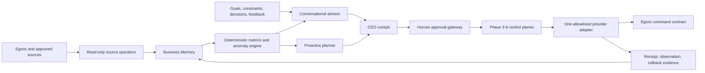

# LeozOps Jarvis Completion Plan

Status: **Approved planning baseline; implementation remains gate-bound**

Approved by: Leoz, Product Owner

Effective: 2026-08-01

Current baseline: `codex/leozops-phase8-controlled-activation@30c5cb6`

## 1. Outcome

LeozOps is complete for the first solo-founder production release when one CEO
can use a single cockpit to:

1. see the current state of the business and what changed;
2. ask a natural-language question and receive an evidence-backed answer;
3. preserve goals, constraints, decisions, and feedback as durable business
   context;
4. receive a small number of timely, deduplicated proactive alerts;
5. inspect a proposed plan and preview one allowlisted operational action;
6. explicitly approve, observe, and if necessary roll back that action; and
7. inspect freshness, cost, latency, incidents, and the kill switch at any time.

This is the target for **LeozOps Jarvis v1**. It is not fictional omniscience,
unrestricted computer control, or a general employee replacement.

## 2. Honest baseline

| Capability | Repository state | Production state |
|---|---|---|
| Read-only Egoric contract | Implemented and locally proven | Not deployed against an accepted named environment |
| Business Memory and CEO Brief | Implemented and deterministic | No live recurring source feed |
| Shadow, supervised action, autonomy, assurance, evidence, activation | Control planes implemented through Phase 8 | No production adapter, real action, or elapsed shadow evidence |
| Conversation and durable CEO context | Not implemented | Not available |
| Proactive event loop and notifications | Not implemented | Not available |
| Jarvis cockpit | Product surfaces defined; no current-track UI in this branch | Not available |
| Voice / ambient access | Deliberately deferred | Not available |

The repository has a strong safety and evidence spine. The remaining distance
is primarily product experience, live data, model orchestration, proactive
delivery, and one real narrow integration.

## 3. Product architecture at completion

Architecture rules:

- deterministic code owns metrics, thresholds, eligibility, and policy;
- a language model may classify, retrieve, explain, and draft, but may not
  invent facts or directly invoke a production adapter;
- every material answer separates fact, inference, recommendation, limitation,
  and action proposal;
- source and action capabilities remain tenant-scoped, narrow, revocable, and
  auditable;
- external scheduling triggers one bounded command-and-exit job; the service
  does not hide an unbounded autonomous loop;
- Egoric remains the operational system of record.

## 4. Execution model for one founder

Two lanes run in parallel only where waiting on external elapsed time would
otherwise block useful repository work.

### Product lane

`Evidence contract -> Ask LeozOps -> Cockpit -> Proactive advisor -> Planner`

This lane can be built and tested with frozen fixtures, deterministic provider
doubles, and disposable databases. Test evidence never counts as production
evidence.

### Production-truth lane

`Named environment -> Postgres -> read-only credential -> network proof -> P2 -> 10-business-day shadow -> G5`

This lane requires real infrastructure, credentials, monitoring, and elapsed
evidence. It cannot be completed by repository code alone.

### Convergence

The lanes converge before a real action is enabled. A conversational UI must
not bypass G5/G6/G7 or the Phase 8 release and observation boundaries.

## 5. Build phases

### Phase 9 — Evidence-grade Ask LeozOps

Goal: turn the current Observer into a useful read-only conversational Advisor.

Deliverables:

- tenant-scoped conversations, messages, runs, evidence citations, feedback,
  CEO goals, constraints, and decision records;
- an evidence-pack builder that retrieves only approved Business Memory,
  deterministic metrics, freshness, provenance, and limitations;
- a question router and typed read-tool registry with no generic SQL, generic
  HTTP, filesystem, or action capability;
- a model-provider boundary, deterministic test provider, strict structured
  response contract, token/cost/timeout budgets, and safe failure states;
- authenticated conversation APIs with idempotency and no cross-tenant reads;
- prompt-injection containment: source text is evidence, never instruction;
- a golden evaluation set covering factual, comparative, insufficient-data,
  stale-data, adversarial, and cross-tenant questions.

Exit gate J1:

- 100% of numeric claims in the golden set cite deterministic evidence;
- unsupported questions say what is missing instead of guessing;
- no route can mutate Egoric or reach an action adapter;
- tenant isolation, replay, budget, timeout, and provider-failure tests pass;
- full SQLite/PostgreSQL regression and TypeScript pass.

Estimated solo effort: **8-12 focused development days**.

### Phase 10 — Medieval CEO Cockpit

Goal: deliver the daily Jarvis experience without widening authority.

Surfaces:

- **Today** — state, changes, three priorities, freshness, and limitations;
- **Ask LeozOps** — streamed conversation with visible citations;
- **Business** — funnel, trends, data quality, and evidence drill-down;
- **Recommendations** — rationale, confidence, impact, feedback, and status;
- **Command Deck** — approval inbox, execution preview, receipts, incidents,
  rollback state, and kill switch; read-only until its gates pass.

Implementation constraints:

- apply the approved medieval LeozOps design language as presentation, not as a
  substitute for state clarity or accessibility;
- responsive keyboard-first UI with reduced-motion and high-contrast support;
- every loading, stale, partial, blocked, unknown, and error state is designed;
- no operational form posts directly to Egoric;
- a new frontend framework requires a recorded architecture decision. The
  default v0 route is the smallest maintainable web stack that can stream chat
  and reuse the existing authenticated service.

Exit gate J2:

- a founder completes the North Star questions in under five minutes in a
  scripted usability run;
- all claims and recommendations drill down to evidence;
- no approval can be confused with successful execution;
- accessibility, responsive layout, auth, and empty/error states pass QA.

Estimated solo effort: **8-12 focused development days**.

### Phase 11 — Proactive Nervous System

Goal: notify the CEO only when a meaningful condition changes.

Deliverables:

- append-only domain-event/outbox contract derived from accepted snapshots;
- deterministic anomaly and change rules with versioned thresholds;
- deduplication, cooldown, quiet hours, severity, acknowledgement, snooze, and
  resolution state;
- daily brief and urgent-alert delivery adapters behind a registry;
- external scheduler contract that invokes one idempotent command-and-exit
  cycle; no hidden daemon or free-running agent;
- notification evidence linking trigger -> facts -> recommendation -> delivery.

Exit gate J3:

- duplicate source polls cannot duplicate alerts;
- late/stale/partial data cannot create a confident alert;
- alert volume and false-positive rate meet an accepted shadow baseline;
- failed delivery is observable and safe to replay without duplicating the
  logical notification.

Estimated solo effort: **6-9 focused development days**.

### Phase 12 — Live Observer and trust gate

Goal: replace local proof with a trustworthy recurring production read loop.

Repository work:

- production container/runtime profile, migration command, readiness probes,
  structured logs, metrics, traces, backup/restore drill, and deployment
  manifest for the named platform;
- secret-reference validation and a least-privilege read-only source adapter;
- operational dashboards for freshness, reconciliation, poll failures, model
  cost/latency, alert delivery, and incidents.

External work:

- name the exact target, region, service, database, source endpoint, and owners;
- provision PostgreSQL, runtime, secrets, monitoring, and the read-only Egoric
  credential outside the repository;
- pass P1 network proof, P2 authorization, ten elapsed business days of shadow,
  reconciliation, revocation, restore, and incident drills;
- issue a real G5 `go`, `extend`, or `revoke` from admitted evidence.

Exit gate J4 is real G5 `go`. Local fixtures, disposable Postgres, or simulated
dates cannot satisfy it.

Estimated solo effort: **4-7 development days plus at least 10 business days
of elapsed shadow evidence** after the environment is ready.

### Phase 13 — Goal-aware Planner

Goal: turn recommendations into explicit, reviewable plans.

Deliverables:

- durable goals, target metrics, time horizons, constraints, assumptions,
  owners, plan versions, checkpoints, and decision history;
- proposal decomposition into measurable steps with evidence and uncertainty;
- conflict detection between goals, budget, policy, and current business state;
- plan simulation and comparison; no action is implied by accepting a plan;
- feedback loop that measures recommendation and plan outcomes without
  rewriting historical evidence.

Exit gate J5:

- plans remain deterministic at their policy boundary and reproducible from
  the recorded context/evidence bundle;
- a changed goal or source fact creates a new version, never silent mutation;
- action-shaped steps must route through the existing approval gateway.

Estimated solo effort: **6-10 focused development days**.

### Phase 14 — One real supervised hand

Goal: earn trust with one reversible, low-risk operational command.

Default candidate: create or update one CEO-approved follow-up task through an
explicit RepositoryRealms command contract. The final command must be selected
only after inspecting the real source API, ownership, reversibility, and user
value.

Deliverables:

- one versioned command schema and least-privilege provider adapter;
- preview, expected impact, risk, expiry, idempotency, approval, execution
  receipt, later observation, and separately approved rollback;
- cockpit approval/receipt/incident experience;
- production credential and adapter registration performed only after G5 and
  the exact G6 policy/evidence gate pass.

Exit gate J6:

- at least 20 accepted supervised production executions, or a Product
  Owner-approved statistically justified minimum for a low-volume command;
- zero unexplained mutation, cross-tenant access, duplicate execution, or open
  severity-1 incident;
- every result is observed and every failed/unknown outcome follows the
  incident and recovery runbook.

Estimated solo effort: **6-10 development days plus live evidence time**.

### Phase 15 — Bounded Autopilot

Goal: allow the same proven command to execute inside one narrow policy.

Deliverables:

- one exact target and policy envelope; no wildcard tenant, command, or scope;
- tighter budget, rate, cooldown, freshness, confidence, and blast-radius
  limits than the supervised policy;
- dry-run simulation, canary cohort, kill switch, incident automation, and
  human recovery;
- progressive rollout with explicit stop conditions and rollback evidence.

Exit gate J7:

- G7 is earned from real supervised history and simulation evidence;
- canary produces no unexplained mutation or unresolved safety incident;
- kill switch and recovery drills pass against the deployed path;
- the CEO can always see why the action qualified and stop future actions.

Estimated solo effort: **5-8 development days plus 2-4 weeks of bounded canary
observation**.

### Phase 16 — Ambient Jarvis and v1 release

Goal: make the proven operating partner fast and natural to access.

Deliverables:

- push/mobile-friendly command deck and optional voice input/output;
- interruptible sessions, confirmation before any action-shaped turn, and a
  visible transition from conversation to approval;
- personal preferences and briefing cadence without weakening tenant or
  evidence boundaries;
- production evaluation dashboard for answer quality, citation coverage,
  alert usefulness, plan acceptance, action outcome, latency, cost, and safety;
- data retention/export/delete controls, disaster recovery evidence, incident
  response, dependency/security maintenance, and a release runbook.

Exit gate J8 / Jarvis v1:

- the outcome checklist in section 1 passes on the live deployment;
- 30-day production SLO and product-quality report is accepted;
- no P0/P1 security, privacy, correctness, or recovery blocker remains;
- a human can operate, inspect, stop, restore, and export the system without
  hidden operator knowledge.

Estimated solo effort: **7-12 development days plus a 30-day release window**.

## 6. Phase 9A repository baseline

Implemented on `codex/leozops-phase9a-conversation-core`:

1. define the answer contract and fact/inference/recommendation/limitation
   taxonomy;
2. add the conversation, message, run, citation, feedback, goal, constraint,
   and decision schemas with SQLite/PostgreSQL append-only guarantees where
   evidence must be immutable;
3. implement an evidence-pack builder over the current Business Memory and CEO
   Brief;
4. expose only typed, read-only tools to a deterministic provider double;
5. ship authenticated conversation create/read/ask endpoints;
6. add golden-answer, tenant-isolation, injection, replay, timeout, and failure
   tests;
7. document the future production model adapter separately from the trusted
   answer contract.

Phase 9A explicitly excludes UI, voice, notifications, a production language
model credential, generic tool use, action execution, and external deployment.

The immediate follow-up is Phase 9B: select and review the production model
provider, implement its adapter against the frozen answer contract, expand the
golden evaluation threshold, add cost/latency evidence, and decide whether
streaming belongs in the provider boundary or the Phase 10 cockpit transport.
No production key is installed by the repository implementation.

## 7. Schedule and critical path

For one focused founder/developer, the repository implementation is roughly
**50-80 focused development days**. Production completion also requires at
least:

- 10 elapsed business days for read-only shadow;
- enough time to collect the accepted supervised-action sample; and
- 2-4 weeks of bounded-autopilot canary plus a 30-day v1 release window.

The shortest honest path is therefore approximately **12-20 calendar weeks**
if infrastructure and source contracts are available when needed. Missing
credentials, undefined command APIs, or interrupted solo-founder time extend
the calendar but do not change the phase order.

## 8. Stop rules

Stop the current phase and create an explicit decision when:

- a requested answer cannot be grounded in the available source contract;
- a source requires PII or broader authority than the approved job needs;
- a model is asked to calculate authoritative metrics or bypass typed tools;
- a UI path could imply that recommendation, approval, execution, observation,
  and success are the same state;
- a real adapter lacks idempotency, observation, or a credible recovery path;
- a schedule or retry could cause a second mutation after an unknown outcome;
- production evidence is being replaced with fixture, local, or simulated data.

## 9. Not required for Jarvis v1

- general desktop control;
- arbitrary web browsing or arbitrary code execution;
- an agent marketplace or multi-agent workforce;
- autonomous finance, invoice, email, social, or ad-spend mutations;
- full nine-stage lifecycle intelligence without the required source facts;
- replacing Egoric screens, data ownership, or employee workflows.

These may be proposed after Jarvis v1 only through new product, source,
security, and evidence decisions.
