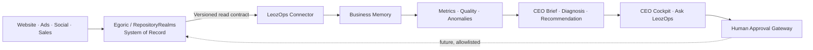

# LeozOps Product Operating Model

Status: **Canonical product architecture**

Effective: 2026-07-28

Product definition: `../PRODUCT.md`

Technical integration contract: `EGORIC_INTEGRATION.md`

## 1. System roles

| Participant | Role | Owns |
|---|---|---|
| CEO/founder | Decision authority | Goals, constraints, approvals, risk tolerance |
| LeozOps | AI Operating Partner | Analytical memory, derived intelligence, briefs, recommendations, future action proposals |
| Egoric / RepositoryRealms | Operational system of record | Leads, clients, users, tasks, invoices, workflows, operational writes |
| External systems | Source or delivery systems | Website, advertising, social, email, payment, and usage facts |

LeozOps never becomes authoritative for an entity already owned by Egoric or an
external delivery platform.

## 2. Target operating loop

The solid path is the current product direction. The dotted path is a future
capability and remains disabled until the supervised-action gate passes.

## 3. Product layers

### Source contracts

Narrow, versioned, revocable interfaces expose only approved facts. The first
contract is the GET-only, PII-minimized Egoric lead snapshot in
`EGORIC_INTEGRATION.md`.

### Connector layer

Authenticates to a source, validates schema and provenance, handles conditional
fetching, and fails closed. Connectors never silently reinterpret unknown
fields and never use a write method in read-only mode.

### Business Memory

Stores immutable source snapshots, connection state, intelligence-run identity,
and audit evidence in a LeozOps-owned database. It is an analytical read model,
not a second operational database.

### Intelligence engine

Produces versioned metrics, data-quality findings, anomalies, and comparisons.
All numerical results are deterministic and reproducible from a source snapshot
plus a formula version.

### Advisor

Turns computed facts into a CEO Brief, diagnosis, and recommendation. AI may
rank, summarize, and explain deterministic outputs. It must cite evidence,
state confidence, preserve known limitations, and distinguish fact from
inference.

### CEO experience

The eventual interface has four product surfaces:

- **Today:** the current CEO Brief and a short priority list;
- **Business:** metrics, funnel state, trends, and data quality;
- **Recommendations:** evidence-backed proposals and feedback;
- **Ask LeozOps:** grounded questions over approved Business Memory.

The raw brief API is sufficient through local end-to-end proof. A broad
dashboard is not on the critical path before the data and brief gates pass.

### Approval and action gateway

Future actions must be explicit proposals with preview, scope, expected impact,
risk, owner, expiry, idempotency key, approval state, execution evidence, and
rollback guidance. The gateway calls allowlisted Egoric commands; it never
writes directly to Egoric storage.

## 4. Ownership boundary

| Concern | Egoric | LeozOps |
|---|---:|---:|
| Operational records and workflows | Owns | Reads approved facts only |
| Source authentication policy | Owns source capability | Owns connector secret handling |
| Source snapshots | Produces | Stores immutable copies |
| Metric formulas and snapshots | Provides facts | Owns and versions |
| CEO Briefs and recommendations | Does not own | Owns and versions |
| Operational actions | Executes | May propose; future gateway may request after approval |
| Approval authority | Records when required | Captures evidence; CEO remains authority |

There is no shared database, generic Director credential, double entry, or
ambient permission inherited from an employee role.

## 5. Customer-lifecycle coverage

LeozOps sits across the lifecycle; it is not one stage in the lifecycle.
Coverage expands only when trustworthy source contracts exist:

1. **Lead and conversion observation:** current snapshot, stages 3–6 roughly.
2. **Activation and retention:** requires client, invoice, onboarding, and usage
   facts that are not in the first contract.
3. **Traffic and acquisition:** requires channel, campaign, spend, and
   attribution contracts.
4. **Expansion:** requires renewal, upsell, revenue, and customer-health facts.
5. **Cross-lifecycle optimization:** requires the preceding domains to pass
   their own data-quality and trust gates.

The first snapshot contains current lead state but no stage history. LeozOps
must not claim historical conversion rates until Egoric exposes durable stage
transitions.

## 6. Trust and safety model

- Metrics are code, versioned, deterministic, and covered by exact tests.
- Generated language is downstream of computed facts, never the source of a
  metric.
- Every output names its snapshot, formula/engine version, freshness, and known
  limitations.
- Tenant identity is distinct from an Egoric client/customer.
- Unsupported schemas, missing provenance, stale data, and reconciliation drift
  surface as errors or quality warnings.
- Read-only mode has a no-write-egress test and excludes legacy mutation routes.
- Action authority is granted capability by capability, not through a broad
  agent or employee credential.
- All future execution is auditable, revocable, rate-limited, and bounded by
  risk and budget controls.

## 7. Deployment profiles

| Profile | Purpose | Allowed surface |
|---|---|---|
| Legacy local | Preserve and test the historical standalone foundation | Existing routes; not an Egoric deployment target |
| `egoric-readonly` | Current canonical integration | Health plus approved tenant intelligence read routes |
| Supervised operator | Future, after G6 approval | Read routes plus individually allowlisted approved commands |

The `egoric-readonly` runtime profile is implemented locally in S1.C with
health plus one authenticated tenant brief route. It remains unapproved for
deployment until G3, G4, and the later deployment gates pass. The default
legacy app must never be deployed as the Egoric LeozOps integration.

## 8. Product decision rule

When a proposed feature conflicts with speed, choose the smallest vertical
slice that improves the CEO's ability to understand and decide. When it
conflicts with ownership or trust, stop and require a recorded product decision.
