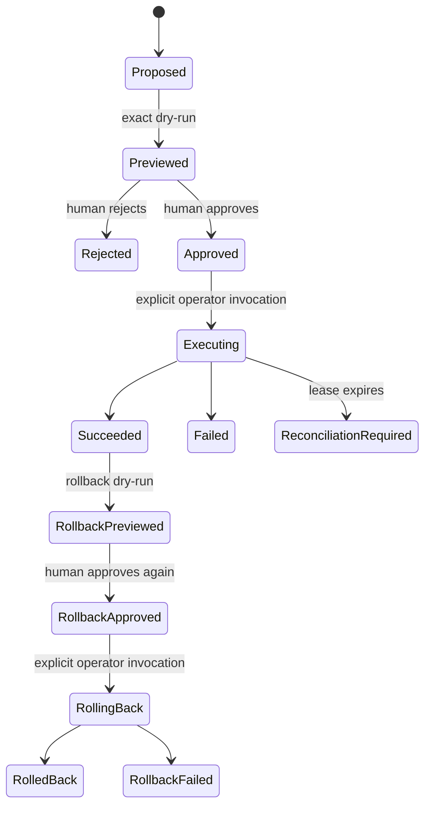

# Sprint 3 / G6 — Supervised Action Plan

Status: **LOCAL CONTROL PLANE COMPLETE; G5 AND EXTERNAL COMMANDS BLOCKED**

Authority: DECISION-002 addendum 14.

## 1. Outcome

Build the smallest safe action gateway that can turn an evidence-backed CEO
recommendation into one individually allowlisted command. A human must see an
exact dry-run, approve the same immutable facts, and explicitly invoke the
command. LeozOps never writes directly to Egoric storage.

This phase implements the local control plane. It does not assert that G5 has
passed and it does not create a RepositoryRealms write contract.

## 2. Hard prerequisites

Every new-action preview, approval, and execution fails closed unless:

1. an immutable Phase 2 release decision for the exact tenant/source is `go`;
2. that `go` decision is still the latest release decision;
3. one accepted, unexpired G6 policy binds the exact G5 evidence, environment,
   target, command key/version, adapter, credentials, and limits;
4. a registered adapter descriptor exactly matches that policy.

A later Phase 2 `extend` or `revoke`, expired policy, unknown adapter, changed
payload, changed preview, or changed approval blocks execution.

Safety exception: one separately previewed and approved rollback for an
already successful action may run for 24 hours after that action even when G5
was subsequently revoked or the policy expired. It remains bound to the
original policy/target/adapter and cannot be used for a new action. An exhausted
rate or daily budget counter cannot disable this recovery path.

## 3. Capability slice

### S3.A — Contract and proposal

- Exact-key, pending-by-default `leozops_g6_action_policy_v1` manifest.
- One command per policy; no wildcard commands or ambient employee credential.
- Immutable proposal containing safe structured payload, evidence references,
  reason/impact codes, expiry, cost estimate, and an idempotency key.
- Recursive secret/PII-shaped-key denial and bounded canonical JSON.

### S3.B — Preview and approval

- Adapter-owned schema validation before proposal acceptance.
- Mandatory dry-run with zero external mutations.
- Preview stores fingerprints and safe effect metadata, never raw provider
  responses, credentials, or PII.
- Approval or rejection is immutable and fingerprint-bound to the policy,
  proposal, preview, approver, nonce, cost ceiling, and expiry.
- Approval credentials are separate from operator credentials even when Leoz
  performs both roles.

### S3.C — Execution and rollback

- Command-and-exit operator; no scheduler and no autonomous loop.
- Single idempotent execution claim per proposal. A live claim returns busy; an
  expired/unknown claim requires manual reconciliation and is never retried.
- Per-hour/per-day rate limits and daily cost ceiling checked again immediately
  before the external call.
- Terminal execution evidence contains safe request/result fingerprints,
  external request ID, mutation count, latency, and cost only.
- Rollback requires a distinct dry-run and distinct human approval. It has its
  own idempotency key and may run at most once.

### S3.D — Audit and release evidence

- Tenant-scoped immutable policy, proposal, preview, approval, and event facts.
- Mutable coordination exists only for an in-progress attempt; database guards
  permit one transition to a terminal result and reject deletion/rewrite.
- Complete SQLite/PostgreSQL migration, rollback, immutability, replay,
  adversarial authorization, and command-adapter tests.
- A production adapter remains absent until a separate command-specific project
  supplies the source contract and external approval.

## 4. State model

Expiry or a revoked prerequisite blocks the next transition; it never silently
changes historical evidence.

## 5. Initial policy limits

The manifest may tighten these bounds but may not exceed them without a new
recorded product decision:

- risk tier: `low` or `medium`; `high` is denied;
- cost: non-negative integer minor units, one currency per policy;
- at most 60 executions per hour and 500 per day;
- approval lifetime: 5–60 minutes;
- execution lease: 30–300 seconds;
- proposal lifetime cannot exceed the policy validity window;
- dry-run, idempotency, and rollback support are mandatory.

## 6. G6 acceptance boundary

The repository-level Phase 3 package is complete when the control plane and all
adversarial tests pass. G6 itself remains blocked until:

- G5 has a real accepted `go` decision;
- a real Egoric command contract exists and is independently reviewed;
- the exact policy is accepted for the named environment;
- command-specific network, dry-run parity, idempotency, rollback, credential
  rotation, rate/budget, audit, incident, and CEO usability evidence passes;
- Leoz records the command-specific G6 release decision.

Passing local tests never authorizes external mutation or G7 autonomy.

## 7. Local completion record

- [x] Exact G5-bound policy and runtime-identity preflight.
- [x] Safe immutable proposal, execute/rollback dry-runs, and approvals.
- [x] Separate credential fingerprints for human approval and invocation.
- [x] Atomic idempotency, lease, rate, daily-count, and budget enforcement.
- [x] Unknown/crashed outcome sealing for manual reconciliation.
- [x] Separately approved one-time rollback and 24-hour recovery window.
- [x] Immutable audit timeline and guarded attempt transition on SQLite and
  PostgreSQL.
- [x] Command-and-exit CLI, empty production registry, adversarial tests, and
  operations runbook.
